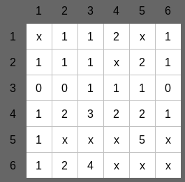

# [Projet TDD](../../readme.md)
## [Tests](../test.md)
### Note
Ce fichier testera les "vrais" services en utilisant la base de données.

### Test du déroulé du jeu

#### Test placerBombeAuto
- Création d'une partie de démineur (6x6 avec 10 bombes)
- Vérification de la création correcte :
    - Grille non nulle
    - Dimensions correctes (6x6)
    - Nombre de bombes correct (10)
- Placement automatique des bombes
- Vérification du nombre exact de bombes placées (10)
- Vérification que l'utilisateur a bien été créé

#### Test perdu
- Création d'une partie de démineur (6x6 avec 10 bombes)
- Vérification de la création correcte
- Placement manuel d'une bombe à la position (1,1)
- Ouverture de la case contenant la bombe (1,1)
- Vérification que le jeu est dans l'état PERDU

#### Test gagne

- Création d'une partie de démineur (6x6 avec 10 bombes)
- Vérification de la création correcte
- Placement manuel des 10 bombes à des positions spécifiques *
- Vérification du nombre exact de bombes placées (10)
- Ouverture systématique de 26 cases sans bombes avec une liste de tests :
    - Chaque test contient : [ligne, colonne, nombre_de_bombes_voisines] *
    - Pour chaque case :
        - Vérification que l'ouverture ne touche pas de bombe
        - Vérification du nombre correct de bombes voisines
- Vérification que le jeu est dans l'état GAGNE

